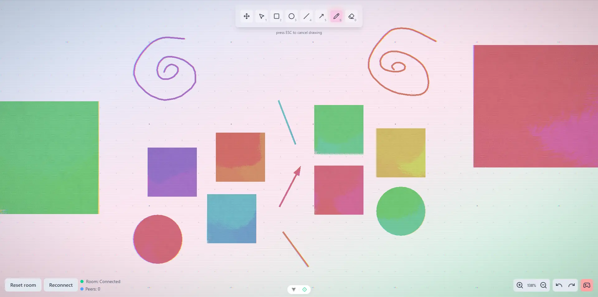

# brushie


a painterly vector playground with jelly motion, brush-based shapes, and interactive effects  
inspired by excalidraw, miro, figma  

demo -- https://brushie.vercel.app/

initially planned as a proper high-performancewhiteboard/vector editor  
but after implementing fundamental features i realized that wanna gamify it a bit and take a deeper dive into shaders  
so dont measure the performance here hahahah  

the app is not about productivity but just vibing  
planned to create a proper 1-2 minute experience by turning it into a game but maaaybe not   
also syncing became not a priority cuz of that, didnt test that well
there are a lot of bugs and missing features, look at the [notes](#notes). also use project search for "TODO:". and left some "NOTE:" comments

use it as a realworld vue3+threejs+glsl+yjs example or as a reference app -- you can see the [documentation](#how-to-understand-the-code-for-devs) below, hope it helps 💞🤘
why threejs and not pixijs? well... forgot that it existed xD

glad to any PRs and feel free to ask any questions on linkedin/telegram。 thanks for the star and support!  

## content
- [about](#brushie)
- [video](#video)
- [screenshots](#screenshots)
- [features](#features)
- [how to use (for users)](#how-to-use-for-users)
- [how to understand the code (for devs)](#how-to-understand-the-code-for-devs)
- [installation](#installation)
- [notes](#notes)

## video
todo

## screenshots



## features
### ✨ core drawing
- draw with pencil, lines, rectangles -- brush-based + painterly
- draft mode for line/arrow with real-time preview before creation
- radial menu on right click: pick color, delete shape
- shape transformations: move, resize, rotate with bounding box handles
- clipboard support: copy & paste shapes with ctrl/cmd + c/v
- undo/redo system (ctrl/cmd + z/y)
- multi-select by dragging
- interactive eraser
- dynamic grid dots (zoom dependent)
### 🎮 game mode
- click on shapes to interact with them
- destroy shapes stroke-by-stroke with juicy particles
- reactive jelly motion and stroke animation
### 💻 ui/ux
- painterly materials with custom fragment/vertex shaders
- inertial UI with floaty toolbars
- zoom and pan with scroll and modifiers
- tooltip hints on hover
- separate overlay canvas for selections, cursors, bounding boxes
- post-processing and mesh highlight for subtle visual feedback
- velocity-based jelly deformation
### 🧠 internals & architecture
- quadtree-based shape lookup for fast hit detection
- modular feature-based architecture (not strict FSD)
- canvas rendered with three.js + raw glsl shaders (custom materials for a background, for painterly+jelly shapes, and for particles)
### 🧪 debug tools
- debug canvas menu (memory, fps, draw calls, vertex count, mesh count). disabled by default
### 🌐 collaboration & sync
- multiplayer sync with yjs
- remote cursors and selections
- network provider switch: websocket or webrtc
- undo/redo across clients
- shape locking & awareness system
### 💾 persistence & pwa
- persistent shape storage in indexeddb
- offline support and pwa integration
- save/load from browser cache

## how to use (for users)
- draw shapes using tools in the top-left corner
- resize, move, rotate
- right-click a shape to access radial menu (color, delete)
- drag to select multiple
- ctrl/cmd + z/y to undo/redo
- scroll to zoom, ctrl/shift/cmd + scroll to pan
- hover on a button to see a tooltip
- game mode allows interaction with rect shapes (click to emit particles and remove shape stroke by stroke)

## how to understand the code (for devs)
used modular feature-based architecture

<details>
<summary>modules/features reference</summary>

### editor

- `editor-core`  
  base visual components and rendering (3d canvas, debug, materials, shaders)  
  hooks for animations, camera control, effects, rendering, zooming

- `editor-game`  
  game mode mechanics, layer logic, and interactive shape gameplay. in a very wip shape  
  and actually making it as a game would require some arch changes  
  to prevent fundamental editor features be tightly coupled with game logic

- `editor-input`  
  user input handling: mouse, 3d tools, cursors

- `editor-shapes`  
  all about shapes: radial menu, hooks for creating, editing, finding, selecting, clipboard, draft, bounding box

- `editor-ui`  
  canvas ui components (container, toolbar) and hooks for tool management. and inertial ui (its looking very fun!!!)

- `editor-sync`  
  yjs syncing integration, network providers (webrtc/websocket), remote cursors, locked shapes, drafts, undo/redo support

### shared
- shared constants, hooks, services (quadtree), shaders, types
- and a couple of ui components -- menu, button, tooltip

### math
- helper utils for geometry, lerp, transforms, easing

### pwa
- progressive web app support
</details>

<details>
<summary>hooks reference</summary>

#### editor-core
- `useCanvasBackground` -- used to make threejs plane to make proper retro pass. initially there was just css background
- `useJellyVelocityAnimation` -- calculates jelly velocity for animated distortion based on motion
- `useGridDots` -- renders subtle grid dots on canvas for alignment and spatial reference
- `useMeshAnimation` -- fade/brush animations for shapes
- `useMeshesManager` -- central shape-to-mesh syncing with create/update/remove logic
- `useMeshHighlight` -- handles mesh color shift effects on hover or selection
- `useOverlayCanvas` -- overlay canvas for selections, cursors, bounding boxes
- `usePan3D` -- pan logic for 3D canvas
- `useParticleSystem` -- manages particles, destruction effects
- `usePointer3DTools` -- 3d helpers (ndc, raycast, world to screen, screen to world)
- `usePostProcessing` -- applies retro effects using composer passes
- `useResizeHandler` -- listens to window size changes and updates viewport
- `useWebGlRenderer` -- sets up threejs context
- `useZoom3D` -- manages zoom and camera

#### editor-game
- `useGameLayer` -- mounts additional game layer for interactivity
- `useGameMode` -- game mode state
- `usePainterlyInteractions` -- handles interaction logic with painterly shapes (click-to-destroy)

#### editor-input
- `useInputEvents` -- global mouse event capture and delegation per tool
- `usePointerCursor` -- manages cursor style and snap updates

#### editor-shapes
- `useBoundingBox` -- provides bounding box handles for shape/group transforms: move, resize, rotate
- `useEraserDraft` -- eraser draft
- `useLineDraft` -- line draft
- `usePencilDraft` -- pencil draft
- `useShapeClipboard` -- handles copy/paste with local clipboard
- `useShapeCore` -- shape creation, deletion, update logic
- `useShapeDraft` -- draft component that handles sync and encapsulates line/pencil/eraser logic
- `useShapeFinder` -- finds shapes at pointer position using quadtree
- `useShapeRadialMenu` -- radial menu logic with color/delete options
- `useShapeSelection` -- shape selection states

#### editor-ui
- `useInertialUI` -- floaty motion for UI panels
- `useToolManager` -- global state for selected tool

#### editor-sync
- `useLockedShapes` -- syncs locked shape state across clients
- `useRemoteCursors` -- renders real-time cursors from other users
- `useRemoteSelection` -- shows other users' shape selections
- `useSyncDraftShapes` -- syncs draft shapes across clients
- `useSyncShapes` -- syncs shapes across clients
- `useUndoRedo` -- undo/redo logic
- `useYjs` -- yjs setup and sync config

#### pwa
- `useOnline` -- tracks network online/offline state

</details>

## installation
```bash
npm install
npm run dev
# or desktop version
npm run tauri dev

# and also start the server with 
cd ./node_modules/y-webrtc
node ./bin/server.js
```

## notes
planned a lot more but realized wanna do something else. took ~2-3 weeks

bugs: 
- recreating line draft and cuz of that seeing material recreation every time
- fix multiple pencils in one position click detection (make click transparent?)
- undo/redo after shape moving - not working
- undo action removes many shapes at once (groups them?)
- do not save drafts in indexeddb
- wrong bounding box if another user moving a line

important todo:
- use https://shihn.ca/posts/2020/resizing-rotated-elements/ for resize rotated
- update shape color sync + saveShapeDB
- useEraserDraft - sync erasedIDs. and if was erasing and pressed escape at the same time then it doesnt removing draft shape on another client
- recheck offline

not important/planned for the future:
- shape z-index layers
- shape customization
- shape draft
- useShapeSelection - lasso selection
- useToolManager - custom tools
- useOverlayCanvas - multitouch
- useZoom - sync zoom like figma
- usePencilDraft - pressure, color lineWidth
- useBoundingBox - snap
- render - instanced mesh
- usePencilDraft - excalidraw drawing
- add vr support
- add text tool
- proper game mode (spawn new shape with timer ?)
